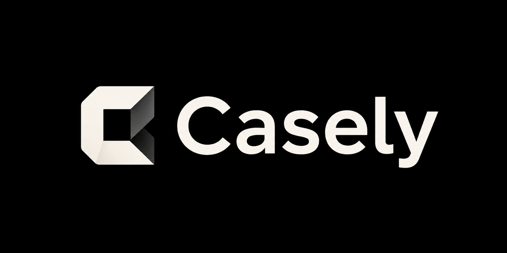

# 🚀 Casely — QA Test Case Generator

<div align="center">



**From messy PDF requirements → TestRail-ready Excel files in 8 minutes.**

[](https://opensource.org/licenses/MIT)
[](https://www.python.org/)
[](#-quick-start)
[](https://github.com/JohnWayneeee/casely-qa-skill/stargazers)
[](https://casely.digital/)

</div>

---

## The problem QA engineers don't talk about

You were hired to catch bugs. Instead, you spend **40% of your time writing test cases**.

Requirements across 10 PDF files. Every project uses different Excel columns. A single module takes 2 days to document. Then the import fails because TestRail expects different headers.

Sound familiar?

> ❌ Fragmented docs scattered across PDF/DOCX/XLSX files
> ❌ Every project has different column names — manual reformatting every time
> ❌ 50 test cases = 2–3 business days of repetitive writing
> ❌ TestRail import fails due to column mismatches
> ❌ No structured plan = missed edge cases and bugs in production

**Every hour spent writing test cases is an hour not spent testing.**

---

## What Casely does instead

Casely acts as your **Virtual QA Lead** — it reads your requirements, learns your team's format, and writes the test cases for you.

```
Requirements PDF  →  /parse  →  /style  →  /plan  →  /generate  →  /export  →  TestRail
```

| Step | Command | What happens |
|------|---------|-------------|
| **Extract** | `/parse` | Docling OCR pulls tables and text from any PDF/DOCX |
| **Learn** | `/style` | Casely reads your existing Excel and clones your column structure |
| **Plan** | `/plan` | Generates a coverage map: "47 tests across 6 modules" |
| **Write** | `/generate` | Creates atomic `.md` test cases — one file per test |
| **Deliver** | `/export` | Batch-converts everything to TestRail-ready Excel |

**The result:** Open `exports/functional_TC001_happy_path.xlsx`. It's a 1:1 match to your team's template, ready for immediate import.

---

## Why teams switch to Casely

| | Casely | Manual writing | Traditional tools |
|---|:---:|:---:|:---:|
| Parses any format (PDF/DOCX/XLSX) | ✅ | ❌ | ❌ |
| Matches **your** column structure | ✅ | ❌ | ❌ |
| Generates a test plan automatically | ✅ | ❌ | ❌ |
| 1 test case = 1 file (atomic) | ✅ | ❌ | ⚠️ bulk only |
| TestRail-ready out of the box | ✅ | ❌ | ⚠️ manual fix |
| Works with English **and** Russian | ✅ | ❌ | ❌ |

---

## ⚡ Quick Start

> **Prerequisites:** Python 3.10+ and [uv](https://github.com/astral-sh/uv)

### Option A — Skills CLI (recommended)

```bash
# bunx
bunx skills add JohnWayneeee/casely-qa-skill

# or npx
npx skills@latest add JohnWayneeee/casely-qa-skill
```

### Option B — Clone & run

```bash
git clone https://github.com/JohnWayneeee/casely-qa-skill.git
cd casely-qa-skill
uv sync
```

Then drop your files into `/input` and start the workflow:

```
/init my-project
/parse
/style
/plan
/generate functional AccountTransfer
/export
```

---

## 📋 Full command reference

| Command | Action | Notes |
|---------|--------|-------|
| `/init` | Scaffold workspace | Run once per project |
| `/parse` | Extract from PDF/DOCX | Uses Docling for high-fidelity OCR |
| `/style` | Clone your Excel format | Reads your example file — no config needed |
| `/plan` | Build coverage map | ISTQB-aligned, shows module breakdown |
| `/generate` | Write test cases | Produces atomic `.md` files, easy to review |
| `/export` | Convert to Excel | Batch output, import-ready |

---

## 8-minute walkthrough

<details>
<summary><strong>Step 1 — Initialize & feed</strong></summary>

```bash
/init my-project
```

Drop two files into `/input`:
- `requirements.pdf` — your specification document
- `example.xlsx` — an existing test case file your team already uses

Casely learns your format from the example. No configuration needed.

</details>

<details>
<summary><strong>Step 2 — Parse & plan</strong></summary>

```bash
/parse       # extracts text and tables from your PDF
/style       # reads your example.xlsx and clones the column structure
/plan        # output: "Detected 6 modules. Recommended: 47 test cases."
```

At this point you have a full coverage strategy before writing a single test.

</details>

<details>
<summary><strong>Step 3 — Generate</strong></summary>

```bash
/generate functional AccountTransfer
```

Casely writes 10+ atomic `.md` files — one per test case. Markdown means you can review and edit in any text editor or Git UI before export.

</details>

<details>
<summary><strong>Step 4 — Export</strong></summary>

```bash
/export
```

Every `.md` file becomes a separate Excel file matching your team's template exactly. Open one — it's ready to import into TestRail or Qase without any manual reformatting.

</details>

---

## Under the hood

- **Docling Engine** — advanced OCR and table extraction for complex, multi-column PDFs
- **Atomic design** — 1 test case = 1 source file = 1 Excel. No monolithic spreadsheets to untangle
- **Style Guide System** — no hardcoded column names; Casely learns from your existing files
- **Language agnostic** — works with English and Russian requirements documents

---

## Hosted version

This open-source skill runs locally in your AI IDE.

If you want a browser UI, file uploads, team review flow, and no local setup:

**[casely.digital](https://casely.digital/)** — join the early access list

Casely web is built for QA teams that want to turn requirements into review-ready test cases without writing a line of code or running local scripts.

[Read more about the hosted version](docs/hosted-web-version.md)

---

## ⭐ Star History

If Casely saved you a work week, a star helps others find it.

[](https://star-history.com/#JohnWayneeee/casely-qa-skill&Date)

---

## FAQ

<details>
<summary>Does it work with scanned PDFs?</summary>

Yes. Casely uses Docling's OCR pipeline, which handles scanned documents, embedded tables, and mixed-format pages.

</details>

<details>
<summary>Can I use my own Excel column structure?</summary>

That's the core feature. Drop your existing template into `/input` and run `/style`. Casely reads your column names and replicates them exactly — no configuration file needed.

</details>

<details>
<summary>Does it support Russian-language requirements?</summary>

Yes. The parser and generator work with English and Russian documents. Column names in your Excel template are preserved as-is.

</details>

<details>
<summary>What's the difference between this and the hosted version?</summary>

This skill runs locally inside your AI IDE (Claude Code, Cursor, etc.). The hosted version at [casely.digital](https://casely.digital/) adds a browser UI, team review workflows, and cloud storage — no local setup required.

</details>

---

## Issues & contributions

**🐛 Found a bug?** [Open an issue](https://github.com/JohnWayneeee/casely-qa-skill/issues)

**⭐ Did it help?** Star the repo — it takes 2 seconds and helps other QA engineers find this.

---

<div align="center">

*Made for QA engineers who were hired to find bugs, not write documents.*

**[casely.digital](https://casely.digital/) — the hosted version for teams**

</div>
