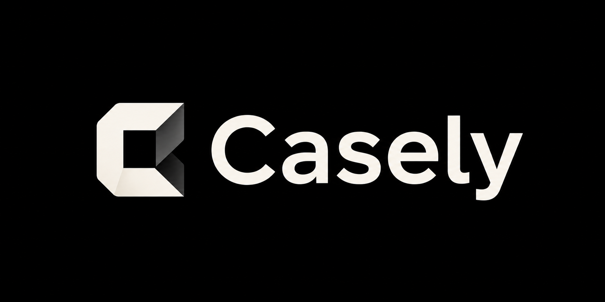

# 🚀 Casely — AI QA Test Case Generator

<div align="center">



**Attach your requirements. Approve the plan. Get a TestRail-ready Excel back.**  
Free, open-source QA skill for Claude Code, claude.ai and the Claude desktop app.

[](https://opensource.org/licenses/MIT)
[](https://github.com/JohnWayneeee/casely-qa-skill/releases)
[](https://github.com/JohnWayneeee/casely-qa-skill/stargazers)
[](https://casely.digital/)

</div>

---

## Watch it work

<!-- VIDEO: replace this block with the walkthrough.
     GitHub renders an uploaded .mp4 inline if you drag it into an issue and paste the
     resulting URL here. For YouTube, link a thumbnail:
     [](https://youtu.be/VIDEO_ID) -->

*Walkthrough video coming soon.*

---

## The problem

You were hired to find bugs. You spend 40% of the week writing test cases instead.

Requirements land as unstructured PDFs. Every project renames the columns, so you remap them
each sprint. One module takes two days to document, and then the TestRail import fails because
the headers don't match.

---

## How it works

Attach your files and say what you need:

> "Here are the requirements for the Payments module and two example test cases my team
> writes. Give me test cases for the refund flow."

Casely runs five phases in that same conversation:

| Phase | What happens |
|-------|--------------|
| **Intake** | Reads your PDF, DOCX or XLSX attachments. No parser, no OCR setup |
| **Style guide** | Copies the column structure and tone from your example file |
| **Test plan** | Proposes coverage, flags holes in the spec, then waits for your OK |
| **Generate** | Writes the cases using boundary values, decision tables and negative paths |
| **Export** | Builds one Excel file your TMS imports in a single pass |

You only get interrupted once, at the plan. Adjust the scope, drop a module, add negative
cases, or say "go".

---

## Install

**Claude Code**

```bash
bunx skills add JohnWayneeee/casely-qa-skill
# or: npx skills@latest add JohnWayneeee/casely-qa-skill
```

**claude.ai and Claude desktop**

1. Clone or download this repo, then zip the skill **from inside `skill/`** so `casely/`
   sits at the root of the archive (not nested under `skill/`):
   ```bash
   cd skill && zip -r casely.zip casely
   ```
2. On claude.ai, open **Settings → Capabilities**, turn on **Code execution** if it isn't
   already, then go to **Skills → Create skill** and upload `casely.zip`.
3. The Claude desktop app uses the same account, so the skill is available there too —
   nothing to install separately.
4. Start a chat, attach your files, describe what you need.

Nothing to install locally. The export step uses `openpyxl`, which already ships inside
Claude's code execution environment. Custom skills are private to your account (Pro, Max,
Team, or Enterprise plan required) and won't sync to a Claude Code install — set that up
separately with the command above.

---

## What you get

- **`exports/all_test_cases.xlsx`** with one row per case and your own column headers. Import
  it once instead of forty times.
- **`results/*.md`**, one file per case, so you can review or version-control them separately.
- **A list of holes in the spec**: contradictions, untestable wording ("should be fast"), and
  error paths the requirements never mention.

The export refuses to write a file it cannot read faithfully. A case that reaches TestRail
without its steps costs more than a failed export, so malformed input gets named and fixed
before delivery.

---

## FAQ

<details>
<summary>Do I need to run commands?</summary>

No. Attach the files, describe what you need, and answer when Casely asks which module to
cover. The one place it pauses is the test plan.

</details>

<details>
<summary>Can I use my team's own Excel columns?</summary>

That is the point. Attach an existing test case file and Casely copies the headers, their
order and the writing style. No config file.

</details>

<details>
<summary>Does it work with Russian requirements?</summary>

Yes. Casely writes the cases in the language of your examples.

</details>

<details>
<summary>Which test management systems can import the output?</summary>

Any tool that reads Excel: TestRail, Qase, Zephyr, Xray. The columns match whatever your team
already uses.

</details>

<details>
<summary>What about scanned PDFs?</summary>

Text-based PDFs, DOCX and XLSX work well. An image-only scan with no selectable text may not
extract cleanly, so export a text version when you can.

</details>

---

## Project structure

```
casely-qa-skill/
├── skill/casely/
│   ├── SKILL.md               # the skill definition and workflow
│   ├── scripts/
│   │   └── export_to_xlsx.py  # Markdown → Excel exporter
│   ├── references/            # test design, style analysis, export details
│   └── evals/                 # evaluation cases
├── docs/hosted-web-version.md
└── marketplace.json
```

---

## Hosted version for teams

This skill runs inside your AI assistant. If your team wants a browser UI, file uploads and a
review flow with no setup, join the early access list at
**[casely.digital](https://casely.digital/)**.

[More about the hosted version →](docs/hosted-web-version.md)

---

## Contributing

Read [CONTRIBUTING.md](CONTRIBUTING.md) before opening a pull request.

- 🐛 [Report a bug](https://github.com/JohnWayneeee/casely-qa-skill/issues/new?template=bug_report.md)
- 💡 [Request a feature](https://github.com/JohnWayneeee/casely-qa-skill/issues/new?template=feature_request.md)
- ⭐ [Star the repo](https://github.com/JohnWayneeee/casely-qa-skill/stargazers) if it saved you a work week

---

## License

[MIT](LICENSE)

<div align="center">

*Made for QA engineers who were hired to find bugs, not write documents.*

</div>
